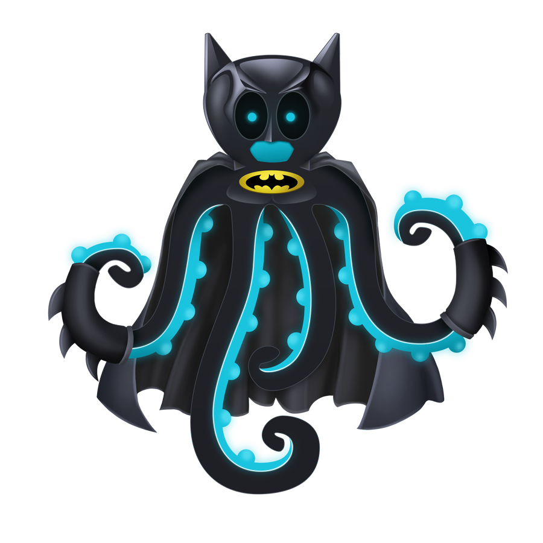

> # 💂‍♂️ Guard [![Tweet][icon_twitter]][twitter_publish] 
>
> Access Control as a Service &mdash; protect any API or sites and content you want.

[![Patreon][icon_patreon]](https://www.patreon.com/octolab)
[![License][icon_license]](LICENSE)

## Roadmap

- [ ] v1: [MVP][project_v1]
  - [**September 20, 2018**][project_v1_dl]
  - Main concepts and working prototype.

## Motivation

- We have to limit access to some part of our content.

## Quick start

Requirements:

- Docker 18.06.0-ce or above
- Docker Compose 1.22.0 or above
- Go 1.11 or above
- GNU Make 3.81 or above

```bash
$ make up status

     Name                    Command               State                              Ports
------------------------------------------------------------------------------------------------------------------------
guard_db_1        docker-entrypoint.sh postgres    Up      0.0.0.0:5432->5432/tcp
guard_etcd_1      /usr/local/bin/etcd              Up      0.0.0.0:2379->2379/tcp, 2380/tcp
guard_legacy_1    docker-php-entrypoint php-fpm    Up      9000/tcp
guard_server_1    nginx -g daemon off;             Up      0.0.0.0:443->443/tcp, 0.0.0.0:80->80/tcp
guard_service_1   service run --with-profili ...   Up      0.0.0.0:8080->80/tcp, 0.0.0.0:8090->8090/tcp,
                                                           0.0.0.0:8091->8091/tcp, 0.0.0.0:8092->8092/tcp,
                                                           0.0.0.0:8093->8093/tcp
```

## Specification

### API

You can find API specification [here](env/client/rest.http).

### CLI

You can use `guard` to start the HTTP server and `guardctl` to execute
[CRUD](https://en.wikipedia.org/wiki/Create,_read,_update_and_delete) operations.

<details>
<summary><strong>CLI interface</strong></summary>

```bash
$ make service-install
$ guard --help
  Guard Service
  
  Usage:
    guard [command]
  
  Available Commands:
    completion  Print Bash or Zsh completion
    help        Help about any command
    run         Start HTTP server
    version     Show application version
  
  Flags:
    -h, --help   help for guard
  
  Use "guard [command] --help" for more information about a command.
$
$ make control-install
$ guardctl --help
  Guard Control
  
  Usage:
    guardctl [command]
  
  Available Commands:
    completion  Print Bash or Zsh completion
    help        Help about any command
    license     Guard License
    version     Show application version
  
  Flags:
    -h, --help   help for guardctl
  
  Use "guardctl [command] --help" for more information about a command.
```
</details>

#### Bash and Zsh completions

You can find completion files [here](https://github.com/kamilsk/shared/tree/dotfiles/bash_completion.d) or
build your own using these commands

```bash
$ guard completion -f bash > /path/to/bash_completion.d/guard.sh
$ guard completion -f zsh  > /path/to/zsh-completions/_guard.zsh
$
$ guardctl completion -f bash > /path/to/bash_completion.d/guardctl.sh
$ guardctl completion -f zsh  > /path/to/zsh-completions/_guardctl.zsh
```

## Installation

### Brew

```bash
$ brew install kamilsk/tap/guard
$
$ brew install kamilsk/tap/guardctl
```

### Binary

```bash
$ export VER=0.0.1      # all available versions are on https://github.com/kamilsk/guard/releases/
$ export REQ_OS=Linux   # macOS and Windows are also available
$ export REQ_ARCH=64bit # 32bit is also available
$ wget -q -O guard.tar.gz \
       https://github.com/kamilsk/guard/releases/download/"${VER}/guard_${VER}_${REQ_OS}-${REQ_ARCH}".tar.gz
$ tar xf guard.tar.gz -C "${GOPATH}"/bin/ && rm guard.tar.gz
```

### Docker Hub

```bash
$ docker pull kamilsk/guard:latest
```

### From source code

```bash
$ egg github.com/kamilsk/guard -- make test install
$ # or use mirror
$ egg bitbucket.org/kamilsk/guard -- make test install
```

> [egg](https://github.com/kamilsk/egg)<sup id="anchor-egg">[1](#egg)</sup> is an `extended go get`.

## Update

This application is in a state of [MVP](https://en.wikipedia.org/wiki/Minimum_viable_product) and under active
development. [SemVer](https://semver.org/) is used for releases, and you can easily be updated within minor versions,
but major versions can be not [BC](https://en.wikipedia.org/wiki/Backward_compatibility)-safe.

<sup id="egg">1</sup> The project is still in prototyping. [↩](#anchor-egg)

---

[![@kamilsk][icon_tw_author]](https://twitter.com/ikamilsk)
[![@octolab][icon_tw_sponsor]](https://twitter.com/octolab_inc)

made with ❤️ by [OctoLab](https://www.octolab.org/)

[icon_gitter]:     https://badges.gitter.im/Join%20Chat.svg
[icon_license]:    https://img.shields.io/badge/license-MIT-blue.svg
[icon_patreon]:    https://img.shields.io/badge/patreon-donate-orange.svg
[icon_tw_author]:  https://img.shields.io/badge/author-%40kamilsk-blue.svg
[icon_tw_sponsor]: https://img.shields.io/badge/sponsor-%40octolab-blue.svg
[icon_twitter]:    https://img.shields.io/twitter/url/http/shields.io.svg?style=social

[project_v1]:      https://github.com/kamilsk/guard/projects/1
[project_v1_dl]:   https://github.com/kamilsk/guard/milestone/1

[twitter_publish]: https://twitter.com/intent/tweet?text=Access%20Control%20as%20a%20Service&url=https://kamilsk.github.io/guard/&via=ikamilsk&hashtags=go,service
